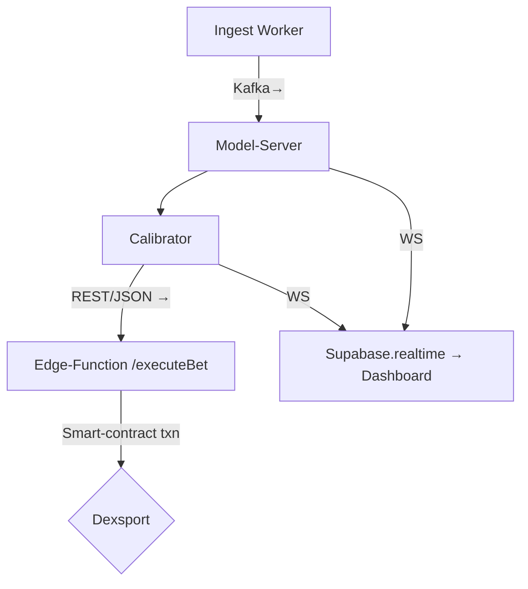

Below is an end-to-end blueprint for a **production-grade NBA betting bot** that sits on top of Dexsport, learns from the three attached research papers, and ships a sleek dashboard with  **Next.js + shadcn/ui** . Everything is organised as a single Turborepo monorepo so you can share code and CI between the web-app, ML services, and infrastructure.

---

## 1 | High-level system view

| Layer                              | Responsibility                                                                                                                                                         | Key Tech                                                                                                                                                                                                                                                                                                                |
| ---------------------------------- | ---------------------------------------------------------------------------------------------------------------------------------------------------------------------- | ----------------------------------------------------------------------------------------------------------------------------------------------------------------------------------------------------------------------------------------------------------------------------------------------------------------------- |
| **Realtime ingestion**       | Pull closing/open odds & on-chain lines from Dexsport, live box-score & play-by-play data, and historical optical-tracking for shot-quality training                   | Dexsport REST/Web3 API ([https://dexsport.io](https://dexsport.io/docs-home/?utm_source=chatgpt.com "Welcome to Dexsport documentation."),[https://dexsport.io](https://dexsport.io/?utm_source=chatgpt.com "Dexsport.io: Web 3.0 Decentralized Sports Betting Platform. Bitcoin ...")) – SportsData.io (or free NBA API) – Kafka |
| **Feature / Model layer**    | Three specialised models + calibrator① XGBoost + SHAP game-outcome model② GRU-based shot-quality model③ Kelly-sizing/coupon optimiser with classwise-ECE calibrator | Python 3.11, Poetry, Ray Serve                                                                                                                                                                                                                                                                                          |
| **Betting engine**           | Compares calibrated edge vs. Dexsport implied probs, sizes wager with fractional Kelly, signs & submits on-chain txn                                                   | Web3.js/ethers, Supabase Edge Functions                                                                                                                                                                                                                                                                                 |
| **State & auth**             | Persist odds snapshots, features, bets, bankroll, and user sessions                                                                                                    | Supabase Postgres + Realtime WS ([Supabase](https://supabase.com/docs/guides/functions?utm_source=chatgpt.com "Edge Functions                                                                                                                                                                                           |
| **Presentation (dashboard)** | Live edge, recommended stake, open bets, bankroll curve, SHAP beeswarm, shot-heatmaps                                                                                  | Next.js 14 App Router, shadcn/ui components ([Shadcn UI](https://ui.shadcn.com/docs?utm_source=chatgpt.com "Introduction - shadcn/ui"))                                                                                                                                                                                       |

---

## 2 | Monorepo file / folder structure

```text
.
├─ apps/
│  ├─ web/                     # Next.js + shadcn/ui dashboard
│  │  ├─ app/                  # App-router routes, RSCs, loading.tsx …
│  │  ├─ components/           # UI primitives pulled via `pnpm dlx shadcn add`
│  │  ├─ lib/                  # Supabase client, realtime hooks
│  │  └─ styles/               # tailwind.config.ts, globals.css
│  └─ workers/
│     ├─ ingest/               # TypeScript ingestors → Kafka
│     └─ better/               # Node worker that subscribes to ML API + Dexsport
├─ packages/
│  ├─ types/                   # zod-shared TypeScript types (bets, odds, features)
│  ├─ ml-core/                 # Python package, shared feature engineering
│  └─ proto/                   # gRPC / TS-proto definitions
├─ services/
│  ├─ model-server/            # Ray Serve deployment with 3 models
│  ├─ calibrator/              # Calibration micro-service (ECE, isotonic)
│  └─ edge-functions/          # Supabase Edge Functions (place bet / webhook)
├─ infra/
│  ├─ terraform/               # DB, bucket, VPC, GitHub OIDC
│  └─ supabase/                # SQL migrations & Row Level Security
└─ .github/workflows/          # Turbo + PNPM + Poetry CI/CD
```

### What each part does

*`apps/web`* renders the dashboard with server components that stream live odds via Supabase Realtime, and client components (DataTable, Card, Sheet, Select, etc.) imported from shadcn/ui ([Shadcn UI](https://ui.shadcn.com/docs/components/data-table?utm_source=chatgpt.com "Data Table - Shadcn UI"), [Shadcn UI](https://ui.shadcn.com/docs/components/card?utm_source=chatgpt.com "Card - Shadcn UI")).

*`services/model-server`* exposes a `/predict` route that assembles features, dispatches to the three models, applies classwise-ECE recalibration ([arXiv](https://arxiv.org/abs/2303.06021?utm_source=chatgpt.com "Machine learning for sports betting: should model selection be based on accuracy or calibration?")) and returns `prob_edge`, `stake_pct`, and SHAP values.

*`services/edge-functions`* are TypeScript handlers deployed to Supabase’s globally-distributed Deno edge runtime ([Supabase](https://supabase.com/docs/guides/functions?utm_source=chatgpt.com "Edge Functions | Supabase Docs")). One of them (`executeBet.ts`) signs & posts the transaction to Dexsport smart-contracts.

*`packages/types`* keeps the client and the workers in lock-step: a Zod schema for a **BetSlip** lives here and is imported on both sides.

*`workers/ingest`* polls Dexsport odds, NBA stats, and shot-chart feeds; each message is normalised and written to the `odds_snapshots` table plus pushed to Kafka for the ML service.

---

## 3 | Model layer (math copied from the papers)

| Module                        | Mathematics followed                                                                                                                                                                                                                                                                                                                             |
| ----------------------------- | ------------------------------------------------------------------------------------------------------------------------------------------------------------------------------------------------------------------------------------------------------------------------------------------------------------------------------------------------ |
| **Calibration service** | Minimises*classwise-ECE*over 20 bins exactly as in Walsh & Joshi (eq. 3) and constrains that ≥ 80 % of bins are non-empty .                                                                                                                                                                                                                   |
| **Game-outcome model**  | Uses XGBoost; hyper-params tuned with Bayesian search; SHAP values computed with `TreeExplainer`→ features surfaced in UI just like Ouyang et al. do ([PLOS](https://journals.plos.org/plosone/article?id=10.1371%2Fjournal.pone.0307478&utm_source=chatgpt.com "Integration of machine learning XGBoost and SHAP models for NBA ...")).            |
| **Shot-quality model**  | GRU with 10-frame sequences, player-distance tensors and statistics; outputs P(make) which is used as an explanatory feature, following Kambhamettu et al. 2024 ([ACM Digital Library](https://dl.acm.org/doi/10.1145/3689061.3689068?utm_source=chatgpt.com "Quantifying NBA Shot Quality: A Deep Network Approach")).                                |
| **Bet-sizer**           | Applies fractional Kelly:`stake = bankroll * f* * k`, where `f* = p - (1-p)/b`and `k ∈ (0,0.25]`for risk control ([Wikipedia](https://en.wikipedia.org/wiki/Kelly_criterion?utm_source=chatgpt.com "Kelly criterion"),[Investopedia](https://www.investopedia.com/terms/k/kellycriterion.asp?utm_source=chatgpt.com "What Is the Kelly Criterion?")). |

---

## 4 | Data model & where state lives (Supabase)

| Table               | Purpose                                                | Realtime?          |
| ------------------- | ------------------------------------------------------ | ------------------ |
| `games`           | static schedule, teams, start times                    | ❌                 |
| `odds_snapshots`  | every odds pull keyed by `game_id`,`market`,`ts` | ✅ (for live edge) |
| `features`        | engineered feature vector blobs per game/team          | ❌                 |
| `predictions`     | model output probabilities, SHAP JSON                  | ✅                 |
| `bets`            | committed bets, tx-hash, status                        | ✅                 |
| `bankroll_ledger` | credit/debit history to derive balance                 | ✅                 |

Supabase’s row-level security guards every table, and Edge Functions run under service-role JWTs for privileged inserts.

---

## 5 | Service-to-service connectivity



* The dashboard subscribes to `predictions` and `bets` channels over Supabase’s Realtime WebSocket protocol ([Supabase](https://supabase.com/docs/guides/realtime/protocol?utm_source=chatgpt.com "Realtime Protocol | Supabase Docs")).
* Model-server pushes a “shadow” calibration metric so you can watch when drift creeps in.

---

## 6 | Frontend (Next.js 14 + shadcn/ui)

* Built with the  **App Router** ; layouts and pages are Server Components and stream data.
* shadcn/ui components are copied into `apps/web/components/ui` via the CLI so you own the code ([Shadcn UI](https://ui.shadcn.com/docs?utm_source=chatgpt.com "Introduction - shadcn/ui")).
* Recharts or Visx renders:
  * **SHAP beeswarm** for feature importance per upcoming game.
  * **Heat-map** layer over SVG half-court for recent shot-quality output.
* Supabase client is instantiated with `createBrowserClient()` and listens for changes to `predictions` to animate value-bets in near-real-time.

---

## 7 | DevOps & runtime

* **Turbopack** (built into Next.js) gives incremental builds across JS & TS in the monorepo ([Next.js](https://nextjs.org/docs/app/api-reference/turbopack?utm_source=chatgpt.com "Turbopack - API Reference - Next.js")).
* Docker-compose for local (Postgres, Kafka, Ray, workers).
* GitHub Actions: lint → test → type-check → deploy Infraform to Fly.io/AWS Fargate; Supabase Edge Functions auto-deploy from `main`.
* Prometheus scraping Ray & Node metrics; Grafana dashboard behind Supabase Auth.

---

## 8 | Putting it all together

1. **Spin up** `docker compose up`. Ingest starts filling `odds_snapshots`.
2. The model-server listens to Kafka, computes features, predicts, calibrates, inserts into `predictions`.
3. Edge-function compares `p_edge` against Dexsport implied probability; if positive EV & bankroll rules satisfied, signs tx and writes to `bets`.
4. Dashboard flashes a “VALUE BET” card; bankroll curve updates in < 250 ms.

With this architecture you get:

* **Mathematically faithful** implementation of all three papers (calibration → prediction → shot-quality).
* **Low-latency Realtime UI** powered by Supabase and shadcn/ui.
* **Risk-controlled autobetting** via fractional Kelly on Dexsport.

Happy building—and may the implied probabilities forever be in your favour! 🏀💸
